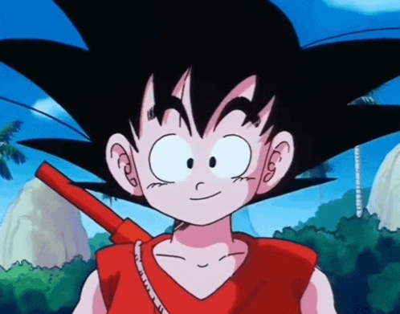

<h1 align="center">🧠 The Debugger of Kamehameha ⚔️</h1>
<p align="center">
  
</p>
<p align="center">
  
</p>

<p align="center">
  <strong><i>Mastering Code. One LeetCode at a time. Ultra Instinct incoming...</i></strong>
</p>

---

## 🌌 About Me
- 👨‍💻 **Name:** Srikar a.k.a `code-srikar`
- 🔗 [LeetCode: Srikar_004](https://leetcode.com/Srikar_004/)
- 💥 DSA Power Level: **900+** (159 on LeetCode)
- 📚 Grinding: **Trees**, **Graphs**, **Dynamic Programming**
- 🧪 Fun Fact: AC = Spirit Bomb. Compilation errors = Krillin moments 😅

---

## 🔥 My Coding Arena
```python
class Saiyan:
    def __init__(self):
        self.name = "Srikar"
        self.platforms = ["LeetCode", "Codeforces", "GFG"]
        self.form = "The Debugger of Kamehameha"
        self.focus = ["DP", "Graphs", "Trees"]

    def train(self):
        while True:
            self.solve_problems()
            self.learn()
            self.break_limits()
```

---

## 🧱 GitHub Stats
<p align="center">
  
  
</p>

---

## 📊 Contribution Graph
<p align="center">
  
</p>

---

## 🐉 Quote That Fuels Me
> "Power comes in response to a need, not a desire." — Goku

---

<p align="center">
  
</p>

<p align="center">
  <b>💯 Next Milestone:</b> Unlock Ultra Instinct Mode → 1000+ problems solved, full mastery over DP 💙
</p>
